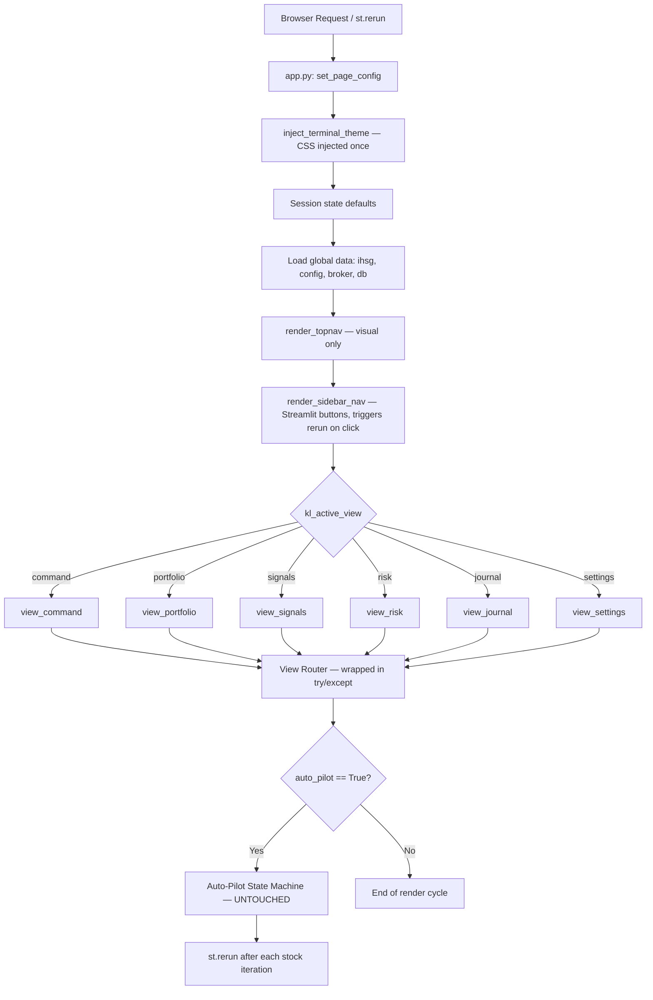
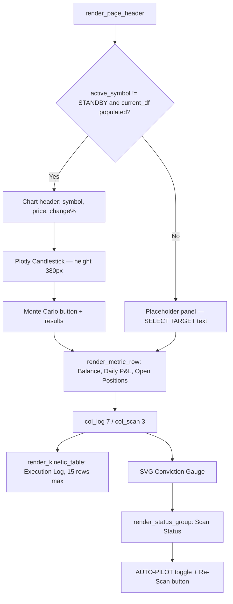

# Design Document: Kinetic Ledger Dashboard Migration

## Overview

This migration replaces the broken and placeholder UI of the Sovereign Quantitative Terminal V15 Pro with a complete "Kinetic Ledger" design system. The scope is strictly **presentation-layer**: all changes are confined to `app.py` (view functions), `components/`, and `ui/terminal_style.py`. Core trading logic in `core/`, `data/`, `integrations/`, `mock_broker.py`, `logger.py`, and `config.json` is untouched.

The Kinetic Ledger design philosophy is "Atmospheric Authority" — a high-density, tonal-depth interface built for institutional traders who need to scan data rapidly without visual noise. Every pixel serves a functional purpose.

### Key Design Decisions

- **Presentation-only scope**: No changes to business logic, signal evaluation, or the auto-pilot state machine.
- **CSS injection pattern**: `ui/terminal_style.py` reads `assets/design_system.css` and injects it via `st.markdown(..., unsafe_allow_html=True)` at app startup, before any view renders.
- **Component pattern**: All UI elements emit raw HTML via `st.markdown(html, unsafe_allow_html=True)` using CSS classes defined in `design_system.css`. Streamlit native widgets (`st.button`, `st.text_input`, `st.toggle`) are used for interactivity and are styled by the CSS overrides in `design_system.css`.
- **No emoji in UI**: Emoji are prohibited in all rendered UI strings. Material Symbols Outlined icons replace all decorative elements.
- **No shadows or gradients**: Depth is achieved through tonal surface layering, not drop shadows or gradient fills.

---

## Architecture

The application is a single-file Streamlit app (`app.py`) with a component library in `components/`. The rendering pipeline is strictly top-to-bottom on each Streamlit rerun.



### Data Flow

```mermaid
graph LR
    subgraph Core Logic — UNTOUCHED
        CL1[core/signals.py]
        CL2[core/executive.py]
        CL3[core/indicators.py]
        CL4[mock_broker.py]
        CL5[data/database.py]
    end

    subgraph Session State — shared bus
        SS1[kl_active_view]
        SS2[scan_results]
        SS3[terminal_log]
        SS4[current_df / active_symbol]
        SS5[auto_pilot / stock_idx]
    end

    subgraph View Layer — MODIFIED
        V1[view_command]
        V2[view_portfolio]
        V3[view_signals]
        V4[view_risk]
        V5[view_journal]
        V6[view_settings]
    end

    subgraph Components — MODIFIED/CREATED
        C1[metric_card.py]
        C2[data_table.py]
        C3[status_indicator.py]
        C4[navigation.py]
        C5[button.py]
        C6[input_field.py — CREATE]
    end

    CL4 -->|get_balance, get_open_positions, get_trade_history| SS2
    CL5 -->|get_equity_snapshots| V2
    CL1 -->|evaluate_signals → summary| SS2
    SS2 --> V1 & V2 & V3
    SS3 --> V1
    SS4 --> V1
    V1 & V2 & V3 & V4 & V5 & V6 --> C1 & C2 & C3 & C4 & C5 & C6
```

---

## Components and Interfaces

### Existing Components (verify/no changes needed)

| File | Exported Functions | Status |
|---|---|---|
| `components/metric_card.py` | `render_metric_card(label, value, color, icon, subtitle)`, `render_metric_row(metrics)` | Verified complete |
| `components/data_table.py` | `render_kinetic_table(headers, rows, align, title, subtitle, max_height, show_filter)` | Verified complete |
| `components/status_indicator.py` | `render_status_indicator(label, description, status, meta)`, `render_status_group(title, statuses)` | Verified complete |
| `components/navigation.py` | `render_topnav(active_view)`, `render_page_header(title, subtitle, show_time, actions)`, `render_sidebar_nav(active_view)` | Verified complete |
| `components/button.py` | `render_button(label, style, icon, full_width)` | Verified complete |

### New Component: `components/input_field.py`

```python
def render_input_field(
    label: str,
    key: str,
    placeholder: str = "",
    value: str = "",
) -> str:
    """
    Renders a Kinetic Ledger styled text input.

    Uses st.text_input() for interactivity. The design_system.css
    already overrides .stTextInput styles with:
      - background: var(--surface-container-highest) = #353535
      - border: none, border-bottom: 1px solid rgba(61,73,71,0.2)
      - border-radius: 4px 4px 0 0
      - font-family: var(--font-mono)
      - focus: border-bottom-color transitions to var(--primary) = #66d9cc

    Args:
        label: Input label text.
        key: Unique Streamlit widget key.
        placeholder: Placeholder text shown when empty.
        value: Default/initial value.

    Returns:
        Current string value of the input field.
    """
```

The CSS overrides in `design_system.css` already handle the visual styling of `st.text_input`. This component is a thin wrapper that ensures consistent usage across views and provides a typed interface.

### `ui/terminal_style.py` — Verify/Fix

The file is complete and correct. `inject_terminal_theme()` reads `assets/design_system.css` relative to its own `__file__` path and injects it via `st.markdown`. The fallback CSS handles the case where the CSS file is missing. No changes required.

---

## Data Models

### Session State Schema

All view functions read from and write to `st.session_state`. The following keys are used:

| Key | Type | Default | Description |
|---|---|---|---|
| `kl_active_view` | `str` | `"command"` | Currently rendered view key |
| `auto_pilot` | `bool` | `False` | Auto-pilot state machine enabled |
| `stock_idx` | `int` | `0` | Current position in watchlist scan loop |
| `scan_results` | `list[dict]` | `[]` | Signal summaries from `evaluate_signals` |
| `terminal_log` | `list[str]` | `[]` | HTML-formatted log entries (max 30) |
| `news_data` | `list` | `[]` | Cached news items |
| `alert_history` | `list[str]` | `[]` | Trade alert strings |
| `current_df` | `pd.DataFrame` | absent | OHLCV data for active symbol |
| `active_symbol` | `str` | `"STANDBY"` | Ticker currently displayed in Command Center |
| `mc_results` | `dict` | absent | Monte Carlo simulation output |
| `health_results` | `dict` | absent | Last health check results |

### Scan Result Dict Schema

Each entry in `st.session_state.scan_results` is a dict produced by `core/signals.py`:

```python
{
    "symbol": str,           # e.g. "BBCA.JK"
    "conviction": float,     # 0.0–10.0
    "close": float,
    "target_1": float,
    "stop_loss": float,
    "wyckoff_phase": str,
    "bee_label": str,
    "inst_footprint": int,   # 0–100
    "accum_days": int,
    "volume_ratio": float,
    "weekly_trend": str,
    "mc_prob_profit": float,
    "mc_risk_rating": str,
}
```

### Design Token Reference

All colors and spacing come from CSS custom properties in `assets/design_system.css`:

| Token | Value | Usage |
|---|---|---|
| `--background` | `#131313` | App background |
| `--surface-container` | `#202020` | Card backgrounds |
| `--surface-container-high` | `#2a2a2a` | Elevated cards, odd table rows |
| `--surface-container-low` | `#1b1b1c` | Card headers, even table rows |
| `--surface-lowest` | `#0e0e0e` | Sidebar, terminal log, inset wells |
| `--surface-container-highest` | `#353535` | Input field backgrounds |
| `--primary` | `#66d9cc` | Teal — focus, active nav, primary data |
| `--primary-container` | `#26a69a` | Primary button background |
| `--secondary` | `#88d982` | Emerald — profit, bullish, online |
| `--tertiary` | `#ffb3ac` | Crimson — risk, bearish, loss, offline |
| `--on-surface` | `#e5e2e1` | Primary text |
| `--on-surface-variant` | `#bcc9c6` | Secondary/muted text |
| `--outline-variant` | `#3d4947` | Ghost border base color |
| `--font-mono` | `ui-monospace, SFMono-Regular, ...` | All numeric data |
| `--radius-lg` | `4px` | Default border radius |

---

## View Specifications

### Critical Bug Fix (app.py line ~658)

Before any view work, the truncated f-string must be fixed:

```python
# BROKEN (line ~658):
<div class="kl-mono-sm" style="color:#ffb3ac;">{len(se

# FIXED:
<div class="kl-mono-sm" style="color:#ffb3ac;">{len(sells) - wins} / {len(sells)}</div>
```

This is inside the Signal Quality panel in `view_signals()`, in the False Signal Tracker section.

### View Router — Error Wrapping

The view router must wrap each view call:

```python
current_view = st.session_state.get('kl_active_view', 'command')
view_fn = view_map.get(current_view, view_command)
try:
    view_fn()
except Exception as e:
    st.error(f"Failed to render view: {e}")
```

Each view function itself also wraps its body in `try/except Exception as e: st.error(...)`.

### View 1: Trading Command Center (`view_command`)

Layout: full-width chart area → 3 metric cards → 7:3 column split (execution log | scan status).



**SVG Gauge formula:**
```python
conv_pct = min(100, int(avg_conviction * 10))  # 0–10 score → 0–100%
offset = 283 - (283 * conv_pct / 100)          # circumference = 2π × r=45 ≈ 283
# Color thresholds:
# conv_pct >= 65 → #88d982 (profit/bullish)
# conv_pct >= 45 → #66d9cc (neutral/primary)
# conv_pct < 45  → #ffb3ac (loss/bearish)
```

**Execution Log parsing:** Strip HTML tags from `terminal_log` entries, split on `] ` to extract timestamp and message. Apply `buy`/`sell`/`loss` color classes based on message content keywords.

### View 2: Portfolio Analytics (`view_portfolio`)

Layout: 2-column top row (equity curve | drawdown tracker) → 2-column bottom row (positions table | sector exposure).

**Equity Curve:** Plotly line chart, `#66d9cc` 1.5px line, dashed reference line at `config['portfolio']['initial_equity']`. Requires `db.get_equity_snapshots()` returning ≥ 2 records. Placeholder text otherwise.

**Drawdown Tracker:** Static card showing `dd_pct` in `#ffb3ac`, configured limit, and peak equity. Formula:
```python
peak = getattr(broker, 'peak_equity', broker.initial_equity)
dd_pct = ((peak - current) / peak * 100) if peak > 0 else 0
```

**Sector Exposure bar color:**
```python
bar_color = "#66d9cc" if pct < 40 else "#ffb3ac"
```

### View 3: Signals & Intelligence (`view_signals`)

Layout: 2:1 column split (scan table + institutional cards | signal quality panel).

**Conviction color logic (pure function):**
```python
if conv >= 6.5:   color_class = "profit"   # #88d982
elif conv >= 4.5: color_class = "neutral"  # #e5e2e1
else:             color_class = "loss"     # #ffb3ac
```

**False Signal Tracker fix** — the complete expression:
```python
f"{len(sells) - wins} / {len(sells)}"
```

### View 4: Risk Management (`view_risk`)

Layout: 8:4 column split (portfolio heat gauge | scenario + kelly) → 4 metric cards row.

**Portfolio Heat gauge formula:**
```python
heat_pct = (total_risk / broker.get_balance() * 100)
heat_normalized = min(100, (heat_pct / max_heat) * 100)
offset = 283 - (283 * heat_normalized / 100)
# Color thresholds:
# heat_normalized > 80 → #ffb3ac
# heat_normalized 50–80 → #bcc9c6
# heat_normalized < 50  → #66d9cc
```

**Scenario Simulator:** Fixed -5% IHSG shock per requirements (Requirement 6.2). The current implementation uses a slider — this must be changed to a fixed display showing the -5% scenario result only. No interactive slider.

**Kelly Criterion:** Display `kelly['label']` text only from `calculate_kelly_suggestion(broker, 1000, 950, config)`.

**Stress Test metric card:**
```python
"PASS" if heat_pct < max_heat else "FAIL"
color = "profit" if heat_pct < max_heat else "loss"
```

### View 5: Trade Journal (`view_journal`)

Layout: full-width closed trades table → full-width monthly P&L bar chart (or placeholder).

**Trade table:** Source from `broker.get_trade_history()` filtered to `action == 'SELL'`, reversed, limited to 20. P&L % calculated as `(realized_pnl / (price * qty)) * 100`.

**Monthly P&L chart:** Group sells by `datetime.fromisoformat(t['date']).strftime('%b')`. Bar colors: `#88d982` for profit months, `#ffb3ac` for loss months. No area fills, no legend inside plot area.

### View 6: Settings & Configuration (`view_settings`)

Layout: 3-column top row (watchlist | parameters | health check) → full-width data hub.

**Watchlist Manager:** Uses `st.text_input` + `st.button`. On submit, check for duplicates before appending to `config['stocks']` and writing `config.json`.

**Parameter Display:** Per Requirement 9.3, parameters are shown as **read-only text**, not sliders. The current implementation uses sliders — this must be changed to static display:
```python
st.markdown(f'<div class="kl-mono-sm">{config["indicators"]["rsi_length"]}</div>', unsafe_allow_html=True)
```

**Health Check:** Reflects last-known cached result from `st.session_state.health_results`. No real-time ping buttons per Requirement 9.8. The current "Run Health Check" button must be removed; status is display-only.

**Terminal readout:** Shows MODE (DEMO/PAPER TRADING), LAST_SYNC time in WIB, and SYSTEM.STATUS summary.

---

## Plotly Chart Configuration

Standard config applied across all views:

```python
fig.update_layout(
    template='plotly_dark',
    paper_bgcolor='rgba(0,0,0,0)',
    plot_bgcolor='#202020',
    margin=dict(l=0, r=50, t=10, b=30),
    xaxis=dict(gridcolor='rgba(61,73,71,0.1)'),
    yaxis=dict(gridcolor='rgba(61,73,71,0.1)', side='right'),
    font=dict(family="ui-monospace, SFMono-Regular, monospace", size=9, color="#bcc9c6"),
    showlegend=False,
)
```

Line traces: `width=1.5`. No `fill` parameter on any trace. Legends placed outside plot area via `showlegend=False` (legend items are rendered as custom HTML dots in card headers instead).

---

## Correctness Properties

*A property is a characteristic or behavior that should hold true across all valid executions of a system — essentially, a formal statement about what the system should do. Properties serve as the bridge between human-readable specifications and machine-verifiable correctness guarantees.*

### Property 1: Conviction score maps to exactly one color class

*For any* conviction score value in the range [0.0, 10.0], the color class assignment function shall return exactly one of `"profit"`, `"neutral"`, or `"loss"` — `"profit"` when score ≥ 6.5, `"neutral"` when 4.5 ≤ score < 6.5, and `"loss"` when score < 4.5 — and the three ranges are exhaustive and mutually exclusive.

**Validates: Requirements 5.2, 5.3, 5.4**

### Property 2: P&L sign maps to exactly one color class

*For any* `realized_pnl` value (positive, negative, or zero), the color class assignment shall return `"profit"` when `realized_pnl >= 0` and `"loss"` when `realized_pnl < 0`. The two cases are exhaustive and mutually exclusive.

**Validates: Requirements 8.2**

### Property 3: Sector allocation threshold maps to correct bar color

*For any* sector allocation percentage in [0.0, 100.0], the bar color shall be `#ffb3ac` when the percentage exceeds 40% and `#66d9cc` otherwise. The two cases are exhaustive and mutually exclusive.

**Validates: Requirements 7.6**

### Property 4: Duplicate ticker prevention preserves list length

*For any* watchlist (list of ticker strings) and any ticker string already present in that list, calling the add-ticker logic with that ticker shall leave the list length unchanged and the list contents identical to the original.

**Validates: Requirements 9.2**

### Property 5: Empty table input always produces at least one rendered row

*For any* call to `render_kinetic_table` with an empty `rows` list, the rendered HTML output shall contain at least one `<tr>` element in the table body, populated with `--` placeholder values.

**Validates: Requirements 12.3**

### Property 6: View functions do not propagate exceptions on empty data

*For any* view function (`view_command`, `view_portfolio`, `view_signals`, `view_risk`, `view_journal`, `view_settings`) called with all data sources returning empty collections or raising exceptions, the function shall not raise an unhandled exception to its caller — it shall render a placeholder state instead.

**Validates: Requirements 1.6, 12.1, 12.2**

---

## Error Handling

### View-Level Error Boundary

Every view function wraps its entire body:

```python
def view_command():
    try:
        # ... all view content
    except Exception as e:
        st.error(f"View error: {e}")
```

### View Router Error Boundary

```python
try:
    view_fn()
except Exception as e:
    st.error(f"Failed to render view: {e}")
```

### Component-Level Defensive Patterns

- `render_kinetic_table`: When `rows` is empty, inject a single placeholder row with `--` values before rendering.
- `render_metric_card`: Accepts any string for `value`; no validation needed.
- `view_portfolio` equity curve: Check `len(eq_data) >= 2` before rendering chart; show placeholder text otherwise.
- `view_journal` monthly chart: Check `if monthly:` before rendering Plotly figure.
- `view_command` chart: Check `if 'current_df' in st.session_state and active_sym != 'STANDBY':` before rendering.

### Auto-Pilot Error Handling (UNTOUCHED)

The existing auto-pilot error handler at the bottom of `app.py` is preserved exactly:

```python
except Exception as e:
    log_to_terminal(f"Auto-pilot error: {e}", is_critical=True)
    st.session_state.auto_pilot = False
    st.error(f"Auto-pilot stopped due to error: {e}. Toggle auto-pilot to restart.")
```

---

## Testing Strategy

### Unit Tests

Unit tests cover specific rendering outputs and edge cases:

- `test_input_field.py`: Verify `render_input_field` returns a string, accepts all parameter combinations, and does not raise on empty inputs.
- `test_navigation.py`: Verify `render_topnav` marks the correct view as active, `render_sidebar_nav` updates `kl_active_view` on button click.
- `test_metric_card.py`: Verify profit/loss/neutral color classes are applied correctly for specific values.
- `test_data_table.py`: Verify empty rows produce placeholder row, verify header count matches column count.
- `test_css.py`: Verify `design_system.css` contains no `box-shadow`, `drop-shadow`, or gradient fills on card/button rules; verify `#000000` does not appear as a color value; verify `--radius-lg: 4px` is defined.
- `test_bug_fix.py`: Verify `ast.parse(open('app.py').read())` succeeds (no SyntaxError).

### Property-Based Tests

Property-based testing is appropriate here because the color-mapping functions, list invariants, and component output properties are pure functions with large input spaces where boundary conditions matter.

Use `hypothesis` (Python) as the PBT library. Configure each test with `@settings(max_examples=100)`.

**Tag format:** `# Feature: kinetic-ledger-dashboard, Property {N}: {property_text}`

```python
# Feature: kinetic-ledger-dashboard, Property 1: conviction score maps to exactly one color class
@given(st.floats(min_value=0.0, max_value=10.0))
@settings(max_examples=100)
def test_conviction_color_exhaustive(score):
    color = get_conviction_color_class(score)
    assert color in ("profit", "neutral", "loss")
    if score >= 6.5:
        assert color == "profit"
    elif score >= 4.5:
        assert color == "neutral"
    else:
        assert color == "loss"

# Feature: kinetic-ledger-dashboard, Property 2: P&L sign maps to exactly one color class
@given(st.floats(allow_nan=False, allow_infinity=False))
@settings(max_examples=100)
def test_pnl_color_exhaustive(pnl):
    color = get_pnl_color_class(pnl)
    assert color in ("profit", "loss")
    assert color == "profit" if pnl >= 0 else color == "loss"

# Feature: kinetic-ledger-dashboard, Property 3: sector allocation threshold maps to correct bar color
@given(st.floats(min_value=0.0, max_value=100.0))
@settings(max_examples=100)
def test_sector_bar_color(pct):
    color = get_sector_bar_color(pct)
    assert color in ("#ffb3ac", "#66d9cc")
    assert color == "#ffb3ac" if pct > 40 else color == "#66d9cc"

# Feature: kinetic-ledger-dashboard, Property 4: duplicate ticker prevention preserves list length
@given(st.lists(st.text(min_size=1), min_size=1), st.integers(min_value=0))
@settings(max_examples=100)
def test_no_duplicate_ticker(tickers, idx):
    existing = list(set(tickers))  # deduplicated list
    ticker_to_add = existing[idx % len(existing)]
    original_len = len(existing)
    result = add_ticker_if_not_exists(existing, ticker_to_add)
    assert len(result) == original_len

# Feature: kinetic-ledger-dashboard, Property 5: empty table always produces at least one rendered row
@given(st.lists(st.text(), max_size=0))  # always empty
@settings(max_examples=100)
def test_empty_table_has_placeholder_row(empty_rows):
    html = render_kinetic_table_to_html(headers=["A", "B"], rows=empty_rows)
    assert html.count("<tr>") >= 2  # at least thead row + 1 tbody row

# Feature: kinetic-ledger-dashboard, Property 6: view functions do not propagate exceptions on empty data
@given(st.just(None))  # trigger empty-data path
@settings(max_examples=100)
def test_views_resilient_to_empty_data(empty):
    # Each view is called with mocked empty broker/db/session_state
    for view_fn in [view_command, view_portfolio, view_signals, view_risk, view_journal, view_settings]:
        try:
            view_fn()  # with mocked empty dependencies
        except Exception as e:
            pytest.fail(f"{view_fn.__name__} raised {e} on empty data")
```

The helper functions (`get_conviction_color_class`, `get_pnl_color_class`, `get_sector_bar_color`, `add_ticker_if_not_exists`) are extracted from the inline logic in view functions into testable pure functions during implementation.

### Smoke Tests

- App imports without error: `python -c "import app"` (requires mocked Streamlit context)
- CSS file exists and is readable: `open('assets/design_system.css').read()` succeeds
- `inject_terminal_theme()` does not raise when CSS file is present
- `from components.input_field import render_input_field` succeeds
- `from ui.terminal_style import inject_terminal_theme` succeeds
- `from ui.heatmap import generate_correlation_heatmap` succeeds
